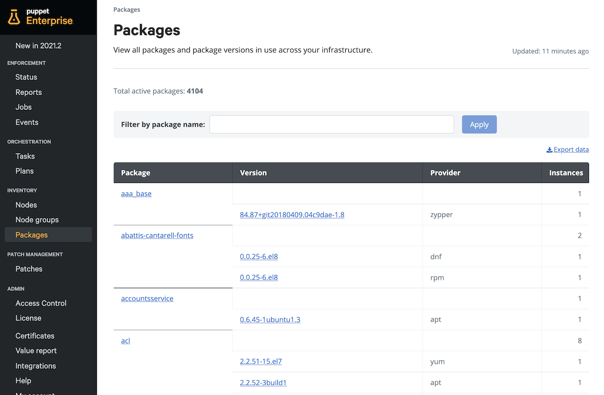

### Table of Contents

- [Overview](#overview)
    - [Viewing Package inventory](#viewing-package-inventory)
    - [Enable and collect Package inventory](#enable-and-collect-package-inventory)

# Overview

Puppet can automatically gather package information across your infrastructure such as package name, version, package manager. Package inventory makes it easy to see which packages you have across your estate without any extra effort on your part. Package inventory is updated each time the Puppet agent reaches out to the Primary Puppet server (default is every 30 minutes).

### Viewing Package inventory

Before viewing package inventory, it must first be enabled. Once enabled, you can navigate to the **Packages** page in the PE sidebar under **Inventory**. You can find an Inventory of packages, their versions, providers and amount of instances across the estate. 

### Enable and collect Package inventory

To collect package inventory, you’ll need to enable it first for all agents. You’ll then need to perform two Puppet runs to begin collecting package inventory. The first run will apply the setting to your nodes and _enable_ package inventory collection. The second run will _collect_ package inventory for the first time.

1. Expand the **PE infrastructure** by clicking the **⊞** sign, then click the **PE Agent** node group.
2. Navigate to the **Classes** tab
3. In the **puppet_enterprise::profile::agent** class, click **Parameter name** and select **package_inventory_enabled** from the list
4. Set its **Value** to **true**.
5. Click **Add to node group**
6. To save the changes, click **Commit 1 change** in the lower right hand corner of the screen. 
7. Ensure you’re still within the **PE Agent** node group and in the top right corner click **Run > Puppet**
8. Once in the **Run Puppet** screen, click the **Run job** button on the bottom right hand corner of the screen - Wait for the Puppet run to complete.
9. Once the Puppet run is complete, click the **Run again** button on the top right hand corner of the screen and click **Run job** again

You can now view package information across your nodes within PE.